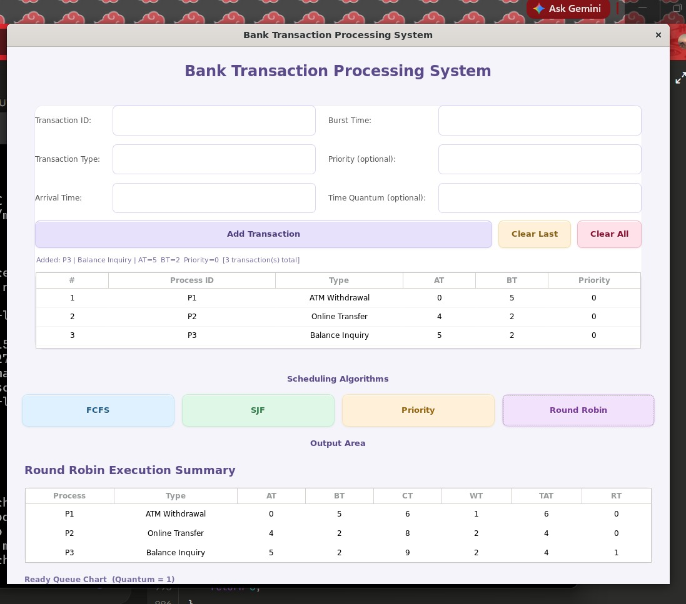
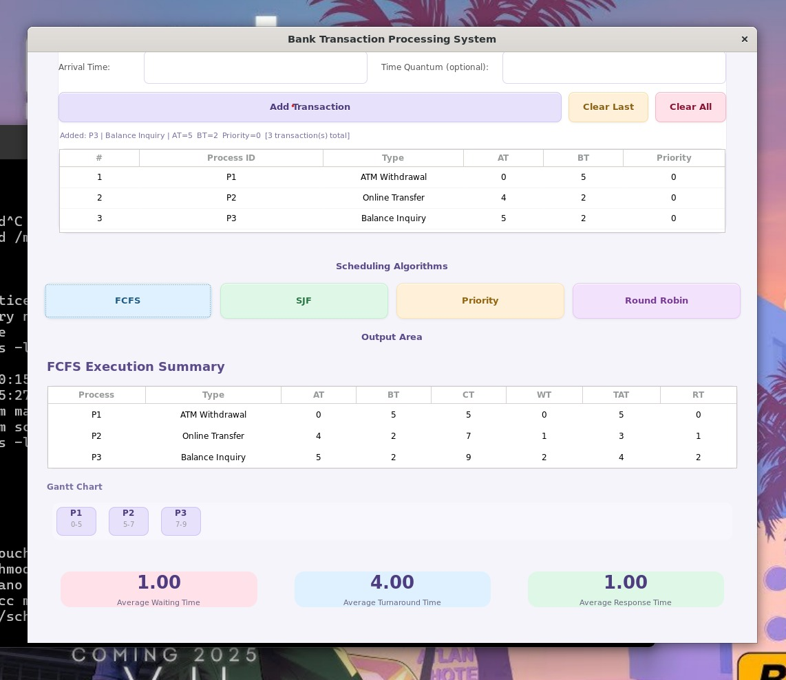
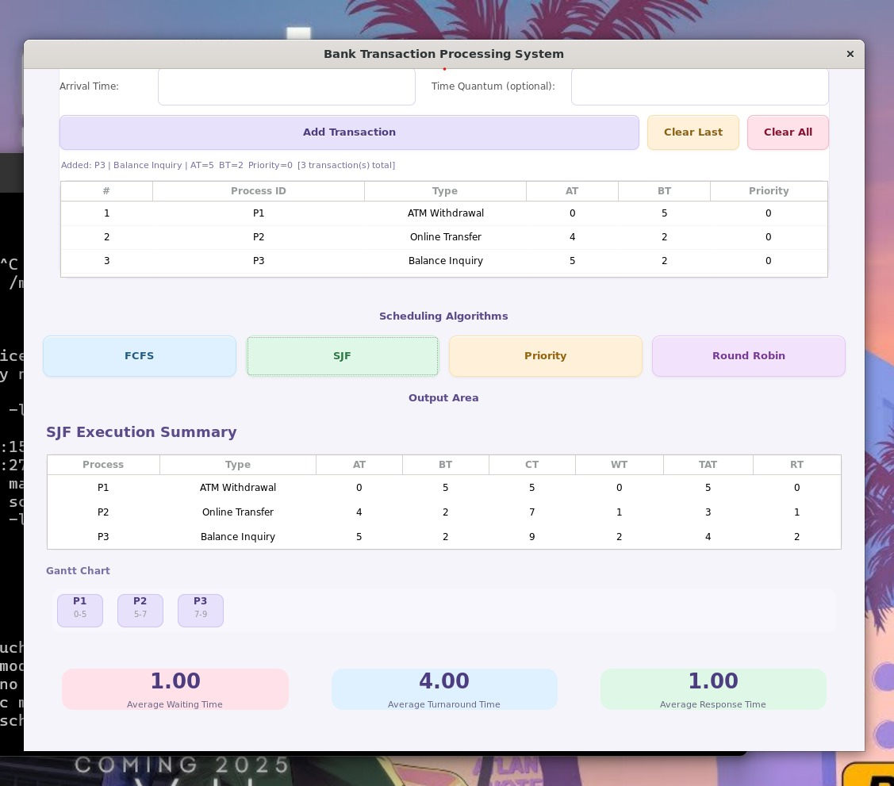
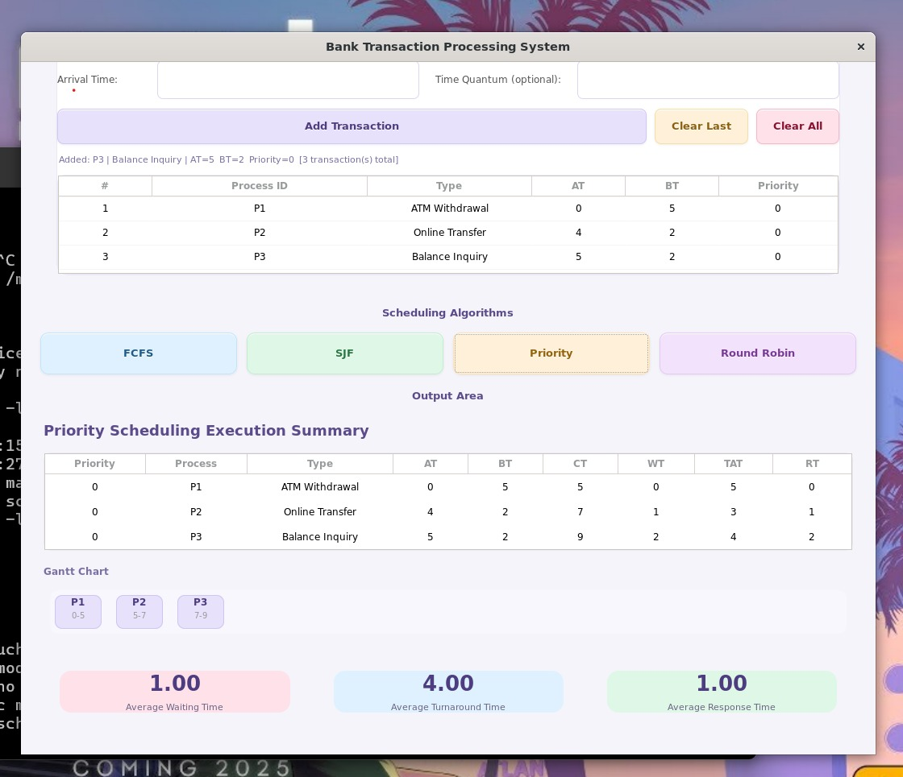
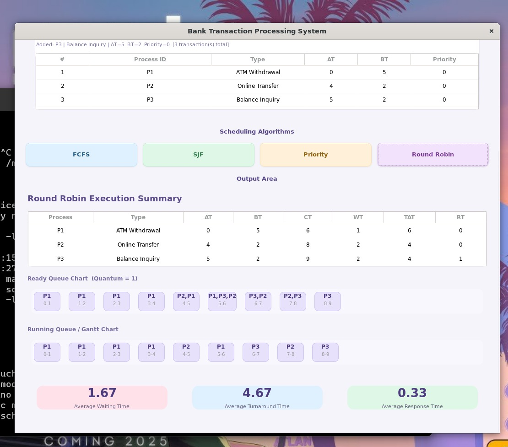

<p align="center">
  
</p>

# 🏦 Bank Transaction Processing System

## Operating System Lab Project

### Shaheed Zulfikar Ali Bhutto Institute of Science & Technology (SZABIST)

---


---

## 👨‍🎓 Student Information

| Field | Details |
|---------|---------|
| Name | Prinkle Kella |
| Registration # | 2480218 |
| Program | BS Software Engineering |
| Semester & Section | 4-C |
| Course | Operating System Lab |
| Course Code | CSCL3107 |
| Instructor | Maria Sajid Gaddi |

---

## 👨‍🎓 Team Member

| Name | Registration # | Program | Semester & Section |
|---------|---------|---------|---------|
| Duaa Tariq | 2480192 | BS Software Engineering | 4-C |

---

## 📖 Project Overview

The Bank Transaction Processing System is an Operating System Lab project developed in C using GTK3 on Linux.

The project simulates bank transactions as CPU processes and demonstrates the practical implementation of major CPU Scheduling Algorithms.

Each bank transaction is treated as a process and is scheduled according to the selected algorithm.

The GUI allows users to:

- Add transactions dynamically
- Execute scheduling algorithms
- View execution summaries
- Generate Gantt Charts
- Compare scheduling performance

---

## 🎯 Implemented Algorithms

### ✅ First Come First Serve (FCFS)

Processes are executed according to arrival time.

### ✅ Shortest Job First (SJF)

Processes with smaller burst times are executed first.

### ✅ Priority Scheduling

Processes with higher priority values are executed first.

### ✅ Round Robin (RR)

Processes are executed using a fixed time quantum and context switching.

---

## 📊 Features

- Dynamic Transaction Input
- GTK3 Graphical User Interface
- FCFS Scheduling
- SJF Scheduling
- Priority Scheduling
- Round Robin Scheduling
- Waiting Time Calculation
- Turnaround Time Calculation
- Response Time Calculation
- Completion Time Calculation
- Average Statistics
- Gantt Chart Generation
- Idle State Handling
- Ready Queue Visualization
- Running Queue Visualization

---

## 🖼️ Project Screenshots

### 1. Transaction Input Screen



---

### 2. FCFS Output



---

### 3. SJF Output



---

### 4. Priority Scheduling Output



---

### 5. Round Robin Output



---

## 🛠 Technologies Used

- C Programming
- GTK+ 3.0
- GCC Compiler
- Linux Environment
- Operating System Scheduling Concepts

---

## 📂 Project Structure

```text
Bank_Transaction_Processing_System/
│
├── main.c
│
├── algorithms/
│   ├── fcfs.c
│   ├── sjf.c
│   ├── priority.c
│   └── round-robin.c
│
├── screenshots/
│   ├── input.jpeg
│   ├── fcfs-output.jpeg
│   ├── sjf-output.jpeg
│   ├── priority-output.jpeg
│   └── round-robin-output.jpeg
│
├── assets/
│   └── szabist-logo.png
│
└── README.md
```

---

# 🚀 Installation & Setup

## Prerequisites

You must have Linux installed using either:

- Ubuntu/Linux Native Installation
- VMware Workstation
- VirtualBox
- Windows Subsystem for Linux (WSL)

---

## Step 1: Update Packages

```bash
sudo apt update
```

---

## Step 2: Install GCC Compiler

```bash
sudo apt install gcc
```

---

## Step 3: Install GTK3 Development Library

```bash
sudo apt install libgtk-3-dev
```

---

## Step 4: Verify GTK Installation

```bash
pkg-config --modversion gtk+-3.0
```

Example Output:

```bash
3.24.41
```

---

## Step 5: Clone Repository

```bash
git clone https://github.com/PrinkleMahshwari/bank_transaction_processing_system.git
```

---

## Step 6: Move into Project Directory

```bash
cd bank_transaction_processing_system
```

---

## Step 7: Compile Project

```bash
gcc main.c -o scheduler `pkg-config --cflags --libs gtk+-3.0`
```

---

## Step 8: Run Project

```bash
./scheduler
```

---

## 📈 Performance Metrics

The project calculates:

- Completion Time (CT)
- Waiting Time (WT)
- Turnaround Time (TAT)
- Response Time (RT)
- Average Waiting Time
- Average Turnaround Time
- Average Response Time

---

## 🎓 Operating System Concepts Covered

This project demonstrates:

- CPU Scheduling
- Process Management
- Process States
- Ready Queue
- Running Queue
- Context Switching
- Time Quantum
- Throughput
- CPU Utilization
- Starvation
- Fairness
- Efficiency

---

## 💡 Learning Outcomes

Through this project, we gained practical experience in:

- Operating System Scheduling Algorithms
- Process Execution Flow
- GTK3 GUI Development
- Linux Development Environment
- Dynamic Data Handling in C
- Gantt Chart Visualization
- Performance Evaluation of Scheduling Algorithms

---

## 🔮 Future Improvements

Planned enhancements:

- Enhanced GUI Design
- Export Results to PDF
- Database Integration
- Multi-Core CPU Simulation
- Advanced Scheduling Algorithms
- Real-Time Process Monitoring
- Statistics Dashboard

---

## ⭐ GitHub Repository

If you found this project useful, please consider giving it a star.

[](https://github.com/PrinkleMahshwari/bank_transaction_processing_system)

---

## 👨‍💻 Authors

### Prinkle Kella

BS Software Engineering — SZABIST Karachi | Registration #: 2480218

[](https://github.com/PrinkleMahshwari)

---

### Duaa Tariq

BS Software Engineering — SZABIST Karachi | Registration #: 2480192 | Semester & Section: 4-C

---

## ⭐ Acknowledgement

This project was developed as part of the Operating System Lab course at SZABIST under the supervision of:

**Maria Sajid Gaddi**

We would like to thank our instructor for providing guidance throughout the implementation of CPU Scheduling Algorithms and GUI Development.

---


## 🔎 SEO Keywords

`Operating System Project`,
`CPU Scheduling`,
`FCFS Scheduling`,
`Shortest Job First`,
`SJF Scheduling`,
`Priority Scheduling`,
`Round Robin Scheduling`,
`Bank Transaction Processing System`,
`GTK3 Project`,
`Linux C Project`,
`Operating System Lab`,
`SZABIST`,
`BS Software Engineering`,
`Process Scheduling`,
`Gantt Chart`,
`CPU Utilization`,
`Throughput`,
`Response Time`,
`Turnaround Time`,
`Waiting Time`,
`C Programming`,
`GTK GUI`,
`Linux Development`,
`OS Scheduling Simulator`,
`Scheduling Algorithms Comparison`,
`Banking Simulation`